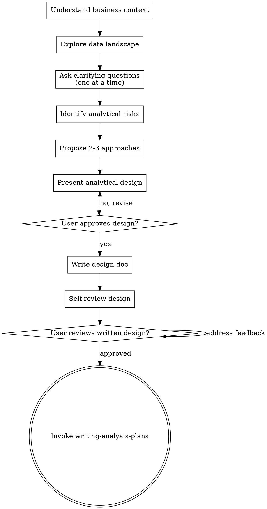

# Brainstorming Analysis Projects

Help turn analytical goals into fully formed designs and plans through structured collaborative dialogue.

Start by understanding the business context and data landscape, then ask questions one at a time to refine the approach. Once you understand the problem, present the analytical design and get user approval.

<HARD-GATE>
Do NOT run any code, load any data, train any model, or begin any implementation until you have presented an analytical design and the user has approved it. This applies to every analysis regardless of perceived simplicity.
</HARD-GATE>

## Anti-Pattern: "This Is Too Simple To Need A Design"

Every analysis goes through this process. A quick summary, a single model, a column exploration — all of them. "Simple" analyses are where unexamined assumptions create the most wasted work. The design can be short for truly simple tasks, but you MUST present it and get approval.

## Checklist

You MUST create a task for each of these items and complete them in order:

1. **Understand business context** — what decision does this analysis support? What's the success criteria?
2. **Explore data landscape** — what data is available? What's the shape, source, time range?
3. **Ask clarifying questions** — one at a time: target variable, known constraints, prior attempts, stakeholder requirements
4. **State 3+ business hypotheses** — articulate specific, falsifiable hypotheses BEFORE any EDA (e.g., "we expect churn to correlate with payment failure rate")
5. **Baseline thinking first** — ask "what would logistic regression achieve?" before proposing complex models
6. **Identify analytical risks** — data quality concerns, potential leakage, class imbalance, temporal issues
7. **Propose 2-3 approaches** — with trade-offs (complexity vs interpretability, speed vs accuracy)
8. **Define validation integrity** — specify the exact train/val/test split strategy and the moment it must be applied (before any transformation)
9. **Present analytical design** — in sections, get user approval after each section
10. **Write design doc** — save to `docs/datapowers/specs/YYYY-MM-DD-<topic>-design.md` and commit
11. **Self-review design** — check for ambiguity, missing data requirements, undefined metrics
12. **User reviews written design** — ask user to confirm the spec before proceeding
13. **Transition to planning** — invoke `datapowers:writing-analysis-plans` skill

## Process Flow



## Hypothesis-First Thinking (Step 4)

Before any EDA, articulate **at least 3 specific, falsifiable hypotheses**:

```
Hypothesis 1: [Factor X] will be positively correlated with [outcome Y] because [domain reason].
Hypothesis 2: [Segment A] will show different behavior than [Segment B] because [domain reason].
Hypothesis 3: [Feature Z] will be the strongest predictor because [domain reason].
```

These hypotheses must appear in the design doc. EDA then tests them — not the other way around.

**Why:** Post-hoc storytelling and p-hacking thrive when analysis is hypothesis-free. Declaring hypotheses in advance forces intellectual honesty.

## Baseline Thinking (Step 5)

Before proposing any approach, answer: **"What would a logistic regression / linear model achieve on this problem?"**

Write the expected baseline score. Then justify complexity only if:
- Baseline score is insufficient for the stated success criteria, OR
- Data has non-linear structure that baseline demonstrably cannot capture

Never propose XGBoost, neural networks, or ensemble methods without first stating the baseline expectation.

## Validation Integrity (Step 8)

Specify the split strategy in the design doc before any data is touched:

```
Split strategy: [random / time-based / group-based]
Split ratios:   train=X%, val=Y%, test=Z%
Applied at:     [describe the exact stage — "immediately after loading raw data, before any transformation"]
Leakage guard:  [explicit statement that no transformer will be fit until after this split]
```

For temporal data: `TimeSeriesSplit` only — no random split.

## Understanding Business Context

Before touching data, answer these questions (ask one at a time):

- **Decision:** What decision will this analysis inform? Who makes it?
- **Success:** How will we know if the analysis was successful?
- **Constraints:** Deadline? Interpretability requirements? Compute limits?
- **Prior work:** Has this been analyzed before? What was found?

## Exploring Data Landscape

Ask or investigate:

- What datasets are available? What format (CSV, database, API)?
- What is the time range? Is it a snapshot or time series?
- What is the grain (one row = one what)?
- Are there known data quality issues?
- What is the target variable (if any)?

## Identifying Analytical Risks

Flag these explicitly in the design:

| Risk | What to Check |
|---|---|
| Target leakage | Features that encode future information |
| Temporal leakage | Train/test split doesn't respect time |
| Class imbalance | Minority class < 20%? |
| Distribution shift | Train and production data differ |
| Missing data | > 5% missing in key columns |
| Small sample | < 1000 rows for ML tasks |
| Proxy discrimination | Features correlated with protected attributes |

## Proposing Approaches

Always propose exactly 2-3 options with explicit trade-offs:

```
Approach A: [Name]
- Method: [technique]
- Pros: [strengths]
- Cons: [weaknesses]
- Best if: [condition]

Approach B: [Name]
...

Recommendation: Approach [X] because [reason].
```

## Design Doc Template

Save to `docs/datapowers/specs/YYYY-MM-DD-<topic>-design.md`:

```markdown
# Analysis Design: [Topic]

## Business Context
[Decision this supports, success criteria, constraints]

## Hypotheses
1. [Hypothesis 1 — specific and falsifiable]
2. [Hypothesis 2]
3. [Hypothesis 3]

## Data
[Sources, schema summary, known quality issues, time range]

## Analytical Risks
[Flagged risks with mitigation plan]

## Baseline Expectation
[What logistic regression / simple model would achieve, and why complexity is/isn't justified]

## Approach
[Chosen approach with rationale]

## Validation Strategy
[Split strategy, ratios, split point, leakage guard statement]

## Evaluation Metrics
[Primary metric, secondary metrics, baseline to beat]

## Deliverables
[What outputs will be produced]

## Out of Scope
[What will NOT be done]
```

## Manifest Integration

| Action | Manifest update |
|--------|-----------------|
| Brainstorming starts | Call `init_manifest(project_name)` to create `artifacts/analysis_manifest.json` |
| Design approved | Call `update_manifest("brainstorming", {...})` with the fields below |

**Fields to write after brainstorming:**

```python
update_manifest("brainstorming", {
    "design_doc": "docs/datapowers/specs/YYYY-MM-DD-<topic>-design.md",
    "hypotheses": [
        "Hypothesis 1 — specific and falsifiable",
        "Hypothesis 2",
        "Hypothesis 3",
    ],
    "primary_metric": "<metric name declared here — lock this>",
    "baseline_expectation": "<what logistic regression is expected to score>",
    "validation_strategy": "<split strategy: random/time-based, ratios, split point>",
})
```

> Do NOT proceed to `writing-analysis-plans` until `brainstorming.primary_metric` is non-null in the manifest.

## Self-Review Checklist

Before asking user to review the written design, check:

- [ ] Are 3+ specific, falsifiable hypotheses stated?
- [ ] Is a baseline expectation documented (not just "we'll try a simple model")?
- [ ] Is the train/val/test split strategy fully specified with the exact application point?
- [ ] Is the success metric specific and measurable?
- [ ] Is the target variable clearly defined?
- [ ] Are all identified risks addressed (even if just documented)?
- [ ] Are evaluation metrics appropriate for the task type?
- [ ] Is "out of scope" explicitly stated?
- [ ] Are there any undefined terms or jargon?
- [ ] Has `init_manifest()` been called and `update_manifest("brainstorming", ...)` written with all required fields?
