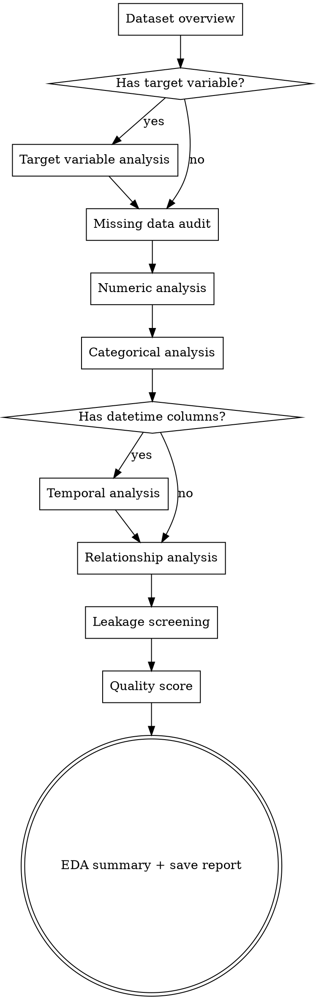

# Data Exploration (EDA)

Systematic, evidence-based exploration of a dataset. Produces a structured understanding of data shape, quality, distributions, and relationships.

**Iron Law: NO MODELING WITHOUT EXPLORATORY DATA ANALYSIS FIRST**

<HARD-GATE>
Do NOT train any model, create any features, or make any analytical conclusions until you have completed ALL sections of EDA. EDA is not optional.
</HARD-GATE>

## Checklist

You MUST create a task for each of these items and complete them in order:

1. **Dataset overview** — shape, schema, dtypes, memory usage
2. **Target variable analysis** — distribution, class balance (if classification)
3. **Missing data audit** — count, pattern, mechanism (MCAR/MAR/MNAR)
4. **Numeric feature analysis** — distributions, outliers, skewness
5. **Categorical feature analysis** — cardinality, value distributions, rare categories
6. **Temporal analysis** — if datetime columns exist, check trends and gaps
7. **Relationship analysis** — correlations, mutual information with target
8. **Leakage candidate screening** — flag suspicious features
9. **Data quality score** — per-column quality rating
10. **EDA summary** — key findings, recommended next steps, blockers

## Process Flow



## 1. Dataset Overview

```python
# Required outputs:
print(df.shape)          # (rows, cols)
print(df.dtypes)         # column types
print(df.memory_usage(deep=True).sum() / 1024**2, "MB")
df.head(5)               # first 5 rows (sanitize if PII)
df.describe(include='all')  # descriptive stats
```

Report: total rows, total columns, numeric count, categorical count, datetime count, memory size.

## 2. Target Variable Analysis

For **classification**:
```python
print(df[target].value_counts())
print(df[target].value_counts(normalize=True))
# Flag if minority class < 20%
imbalance_ratio = df[target].value_counts().min() / len(df)
if imbalance_ratio < 0.20:
    print(f"⚠️ CLASS IMBALANCE: minority class = {imbalance_ratio:.1%}")
```

For **regression**:
```python
print(df[target].describe())
# Check skewness
skew = df[target].skew()
if abs(skew) > 1.0:
    print(f"⚠️ SKEWED TARGET: skewness = {skew:.2f}, consider log transform")
```

## 3. Missing Data Audit

```python
missing = df.isnull().sum()
missing_pct = missing / len(df) * 100
missing_report = pd.DataFrame({
    'count': missing,
    'pct': missing_pct
}).query('count > 0').sort_values('pct', ascending=False)
print(missing_report)
```

Flag columns:
- `> 50%` missing → **CRITICAL** — likely unusable
- `5–50%` missing → **HIGH RISK** — document imputation strategy
- `< 5%` missing → **LOW RISK** — document imputation strategy

Investigate pattern: are missing values random (MCAR) or correlated with other features (MAR/MNAR)?

## 4. Numeric Feature Analysis

For each numeric column:
```python
for col in numeric_cols:
    print(f"\n--- {col} ---")
    print(df[col].describe())
    skew = df[col].skew()
    print(f"Skewness: {skew:.2f}")
    # Outlier detection via IQR
    Q1, Q3 = df[col].quantile([0.25, 0.75])
    IQR = Q3 - Q1
    outliers = ((df[col] < Q1 - 3*IQR) | (df[col] > Q3 + 3*IQR)).sum()
    print(f"Outliers (3×IQR): {outliers} ({outliers/len(df):.1%})")
```

Classify each column:
- `BOUNDED` — values have natural min/max (age, percentage)
- `UNBOUNDED` — values can grow without limit (revenue, count)
- `SENTINEL` — suspicious values like -999, 0 in age columns

## 5. Categorical Feature Analysis

```python
for col in categorical_cols:
    n_unique = df[col].nunique()
    top_values = df[col].value_counts().head(10)
    rare = (df[col].value_counts() < 0.01 * len(df)).sum()
    print(f"{col}: {n_unique} unique, {rare} rare categories (<1%)")
    print(top_values)
```

Classify each column:
- `LOW_CARDINALITY` (≤ 20 unique) — safe for one-hot encoding
- `MEDIUM_CARDINALITY` (21–100) — consider target or frequency encoding
- `HIGH_CARDINALITY` (> 100) — embedding or aggregation needed

## 6. Temporal Analysis

```python
for col in datetime_cols:
    print(f"\n--- {col} ---")
    print(f"Range: {df[col].min()} to {df[col].max()}")
    print(f"Duration: {df[col].max() - df[col].min()}")
    # Check for gaps
    gaps = df[col].sort_values().diff().describe()
    print(f"Gaps between records:\n{gaps}")
```

Flag: irregular gaps, future dates, dates before expected start.

## 7. Relationship Analysis

```python
# Numeric-to-target correlations
corr = df[numeric_cols + [target]].corr()[target].sort_values(ascending=False)
print("Correlations with target:\n", corr)

# Flag near-perfect correlations (potential leakage)
corr_matrix = df[numeric_cols].corr().abs()
high_corr_pairs = [(i, j, corr_matrix.loc[i, j])
                   for i in corr_matrix.columns
                   for j in corr_matrix.columns
                   if i < j and corr_matrix.loc[i, j] > 0.95]
if high_corr_pairs:
    print("⚠️ HIGH CORRELATION PAIRS (>0.95):", high_corr_pairs)
```

## 8. Leakage Candidate Screening

Flag any column that:
- Has correlation > 0.95 with the target
- Has a name suggesting post-prediction knowledge (`*_result`, `*_outcome`, `*_final`)
- Is recorded AFTER the prediction event (temporal leakage)
- Perfectly predicts the target (correlation = 1.0)

```
⚠️ LEAKAGE CANDIDATES:
  - [column_name]: [reason for suspicion]
```

**These MUST be reviewed by a human before feature engineering begins.**

## 9. Data Quality Score

Rate each column 0–100:

| Factor | Weight | Score Basis |
|---|---|---|
| Completeness | 40% | 100 × (1 - missing_pct) |
| Type consistency | 30% | 100 if no mixed types, 0 otherwise |
| Value validity | 30% | 100 if no sentinel values or out-of-range values |

Columns scoring < 50 are flagged as **LOW QUALITY** and require remediation before use.

## 10. EDA Summary

Save to `docs/datapowers/eda/YYYY-MM-DD-<dataset>-eda.md`:

```markdown
# EDA Report: [Dataset Name]

## Dataset
- Rows: X, Columns: Y
- Memory: Z MB

## Key Findings
1. [Most important finding]
2. [Second finding]
3. [...]

## Data Quality Issues
- [Issue]: [Severity] — [Recommended action]

## Leakage Candidates
- [Column]: [Reason] — MUST REVIEW BEFORE FEATURE ENGINEERING

## Recommended Next Steps
1. [Action] — [Skill to use]

## Blockers
- [Anything that prevents moving forward]
```

## Red Flags

**Never:**
- Skip EDA because the dataset "looks clean"
- Train a model before identifying class imbalance
- Ignore leakage candidates without documenting the decision
- Report column statistics without checking for sentinel values
- Assume correlations imply causation

## Manifest Integration

| Action | Manifest update |
|--------|---------------|
| EDA report saved | Call `update_manifest("data_exploration", {...})` |

**Fields to write after data-exploration:**

```python
update_manifest("data_exploration", {
    "eda_report_path": "docs/datapowers/eda/YYYY-MM-DD-<dataset>-eda.md",
    "quality_score": 78,   # overall dataset quality score 0-100
    "leakage_candidates": ["col_x", "col_y"],  # from Section 8
})
```

> `leakage_candidates` from EDA feeds directly into `leakage-guard`. If this list is non-empty, `leakage-guard` must run before feature engineering.
