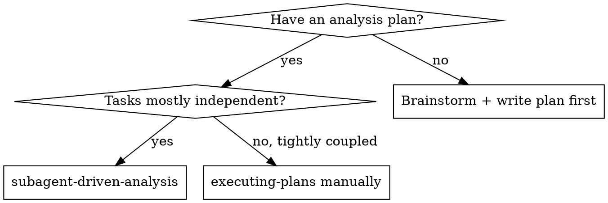
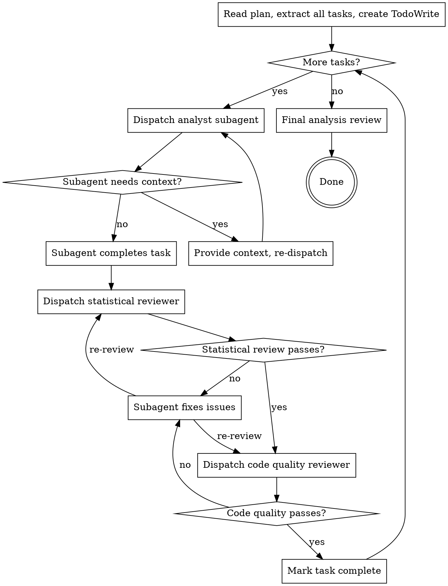

# Subagent-Driven Analysis

Execute analysis plans by dispatching fresh subagents per task. Two-stage review after each task: statistical correctness first, then code quality.

**Why subagents:** Each analysis task gets a fresh agent with only the context it needs. This prevents context pollution between tasks, keeps each agent focused, and produces independently reviewable outputs.

## When to Use



## The Process



## Subagent Prompts

### Analyst Subagent Prompt

```
You are an analyst executing a specific task. Do NOT ask about the broader analysis — focus only on this task.

**Task:** [task name]

**Context:**
- Analysis: [one sentence description]
- Design doc: [path]
- Previous task outputs: [list of files produced so far]

**This task:**
[full task text from plan, verbatim — no paraphrasing]

**Constraints:**
- No data leakage: do NOT fit transformers on test data
- No test set evaluation during this task unless explicitly specified
- Random seed: 42 for all random operations
- Save all outputs to: [exact paths]

When complete, report:
- DONE: [summary of what was produced]
- DONE_WITH_CONCERNS: [what was produced] + [specific concern]
- NEEDS_CONTEXT: [exactly what information is missing]
- BLOCKED: [what cannot be done and why]
```

### Statistical Reviewer Prompt (use agents/statistical-reviewer.md)

```
You are a statistical reviewer. Review the following task output for correctness.

**Task that was completed:** [task text]

**Outputs to review:** [file paths]

**Review focus:**
1. Is there any target leakage in the output?
2. Were transformers fit only on training data?
3. Are the computed statistics correct (check formulas, not just code)?
4. Is the train/test split respected?
5. For model tasks: is the metric appropriate for the task type?

Report: APPROVED or ISSUES FOUND: [list specific issues with exact line/code references]
```

### Code Quality Reviewer Prompt (use agents/code-quality-reviewer.md)

```
You are a code quality reviewer for data analysis code.

**Code to review:** [file paths / git diff]

**Review focus:**
1. Are pandas operations vectorized? (no iterrows, no for-loops over rows)
2. Are random seeds explicitly set for all random operations?
3. Are all artifacts saved to the expected paths?
4. Are there hardcoded values that should be parameters?
5. Is the code readable and commented at key decision points?

Report: APPROVED or ISSUES FOUND: [list specific issues]
```

## Handling Subagent Status

**DONE:** Proceed to statistical review.

**DONE_WITH_CONCERNS:** Read the concerns. If they touch correctness or leakage, address before review. If observational (e.g., "data is very sparse"), document and proceed to review.

**NEEDS_CONTEXT:** Provide the missing information. Re-dispatch same model.

**BLOCKED:**
1. Missing data/file → provide it and re-dispatch
2. Task too large → split into two tasks and re-dispatch each
3. Plan error → escalate to human before proceeding

## Review Order

**Statistical review always precedes code quality review.**

Reason: if the statistics are wrong, the code quality is irrelevant. Fix correctness first, then polish.

## Model Selection

| Task Type | Model |
|---|---|
| Mechanical (load data, save CSV, simple transformation) | Fast model |
| Analytical (EDA, feature decisions, evaluation interpretation) | Standard model |
| Review, debugging, architectural decisions | Most capable model |

## Red Flags

**Never:**
- Skip statistical review before code quality review
- Run two analyst subagents on the same dataset simultaneously
- Proceed to next task while a review has open issues
- Allow subagent to evaluate on test set unless the task explicitly calls for it
- Make subagent read the full plan — provide only the specific task text
- Ignore BLOCKED status without addressing the root cause
